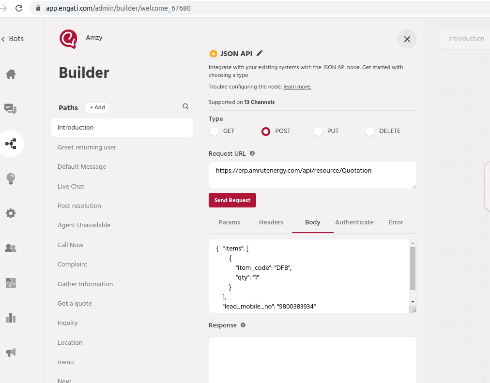

## Amrut Energy

[1]set all engati related values


[2] Note the api key and secret for 'Default Api User For Engati'


[3] Engati quotation call values

https://erp.amrutenergy.com/api/resource/Quotation

Authorization token XX:YY


[4] quotation value



```
{

    "items": [

        {

            "item_code": "DFB",

            "qty": "2"

        }

    ],

    "docstatus": 1,

    "selling_price_list": "Desert Power Solution",

    "lead_mobile_no": "9800383935"

}
```

Customization for amrut energy company

#### License

MIT

<hr>

#### Contact Us  

<a href="https://greycube.in"></a> <br>
1<sup>st</sup> ERPNext [Certified Partner](https://frappe.io/api/method/frappe.utils.print_format.download_pdf?doctype=Certification&name=PARTCRTF00002&format=Partner%20Certificate&no_letterhead=0&letterhead=Blank&settings=%7B%7D&_lang=en#toolbar=0)
<sub>  </sub>
& winner of the [Best Partner Award](https://frappe.io/partners/india/greycube-technologies) <sub>  </sub>

<h5>
<sub> </sub> <a href="https://greycube.in"> greycube.in</a><br>
<sub> </sub> <a href="mailto:sales@greycube.in"> 
 sales@greycube.in</a><br>
<sub> </sub> <a href="https://www.linkedin.com/company/greycube-technologies"> LinkedIn</a><br>
<sub> </sub><a href="https://greycube.in/blog"> Blogs</a> </h5>

